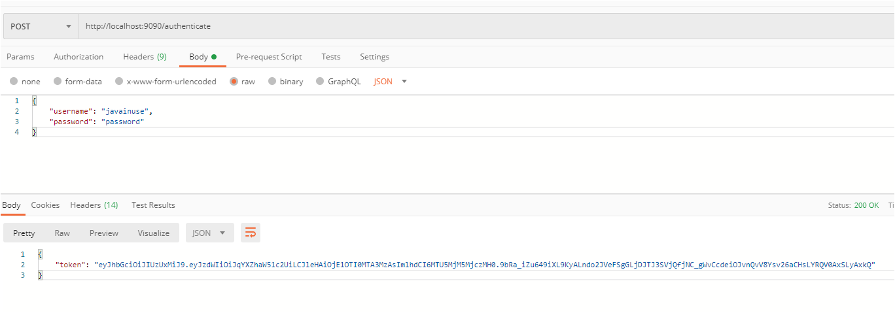
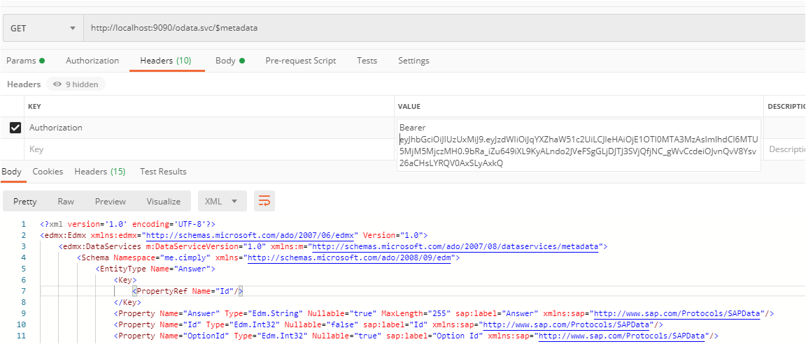

# OData MJZSoft Sample

An extension over [https://github.com/jpenninkhof/odata-boilerplate](https://github.com/jpenninkhof/odata-boilerplate) for a customized OpenUI5 launchpad. 

The OData MJZSoft Sample combines OpenUI5 with Spring Boot, OLingo and JPA and allows you to easily and quickly boot up a JVM based OData app based on modeling your data model in using JPA.


For convenience, a base-diagram for the JPA diagram editor has been provided as well. Once your data model is finished, the application with update the database schema of the connected database on first run. After every change and restart, the application will attempt to alter the database schema according to the changes detected in the JPA model.

By default, the application comes with just one entity: Members, that is automatically populated with a few names from Application.java

Once the application is running, you can browse to http://localhost:9090 to run the sample OpenUI5 application that is using the OData service. The service itself is available from http://localhost:9090/odata.svc

## Features

- Deploys on any VM, including Tomcat, HANA Cloud Platform, Azure, but also on plain Java using built-in Tomcat
- Full CRUD support on all JPA entities
- Feature-complete OData v2 support, including $filter, $expand, $select, $count, $top, etc
- Language dependent annotation support for Smart controls (through i18n.properties files)
- Connects to most SQL databases, including SQL server, HANA, MySQL, HSQLDB, Derby
- Automatically creates database schema based on JPA model

## Prerequisites

To be able to run this application, you need Java JDK 1.7 (or higher) and Maven.

## Installation

To install the mjzsoft sample, you can just clone this repository to your computer.

After cloning it, set the connection parameters to connect to a database in `application.properties`

## Usage

To run the application just enter `mvn spring-boot:run`

To stop the application press control-C

If you run the app with `mvn spring-boot:run` you can access it via [http://localhost:9090](http://localhost:9090).

However if you try to run the app via `run on Server` in eclipse then you need to access it like [http://localhost:9090/<artifactName>/](http://localhost:9090/<artifactName>/) which in our case is [http://localhost:9090/openui5_custom_launchpad/](http://localhost:9090/openui5_custom_launchpad/).

To build a jar run `mvn clean package`

To run the jar `mvn -jar target/odata-0.1.0.jar`

## HANA Cloud Platform

The mjzsoft sample is compatible with both the local as well as the cloud-runtime of HANA cloud platform and will compile to a WAR when Maven profile 'hcp' is selected (which happens to be the default ;).

When the application is run on the HCP cloud, it will automatically connect to the default database connection and start updating the database schema there. It is of couse still possible to connect the Java application to another data-source using the cockpit.

When you run the application from Eclipse on a local HANA Cloud Platform runtime, the site will be available on http://localhost:9090/odata. Also, through configuration of web.xml, authentication is switched on. When you run the application on a local HCP runtime without modifying web.xml, you need to add a user to your local server. You can do this by double clicking your HCP local server and adding a user to the 'users' tab.

## Azure

To get the application running on Azure, it is probably easiest to compile the app to a jar using `mvn -P jar`, After that, you can just pick up the jar file from the target directory and FTP it into an Azure web application. To make Azure aware of the jar file, point the web.config to the jar file, as described on this page: https://azure.microsoft.com/documentation/articles/web-sites-java-custom-upload/#springboot

To make the logging go into the right directory, make sure this line is present in the application.properties file in the resources directory: `logging.path = D://home//LogFiles`. You may also want to remove the logback.xml from the resources directory, which is required for HANA Cloud Platform, but not for Azure.

## Respository package

The only reason that the repository package is there, is because I liked the mjzsoft sample to create some initial (demo/test) data on first launch. However, if you don't need this, it is safe to remove the repository package. It is not necessary to create a repository class for every entity in the model and only modelling entity classes will suffice when you just want to have tables in the database and expose them through OData.

## Annotations

There are some limited (for now) features to add annotations allowing you to leverage smart controls and templates. At this moment it is possible to add annotations on attribute level by applying the `@Sap` annotation and/or @SAPLineItem just before the attribute definition, e.g.:

	@Sap(filterable=true, sortable=true)
	@SAPLineItem
	private String lastName;

The `sap:label` annotation with a language dependent label is automatically added, if the label has been defined in an `i18n` table in the resources directory. i18n-tags should be formatted according to <entity>.<attribut> notation, for example: `Member.LastName=Achternaam`. A sample i18n table has been provided in the mjzsoft sample.

Applying the @SAP annotation  will result in SAP annotations being added in an almost similar to what SAP Gateway would do:

	<Property
		Name="LastName" Type="Edm.String"
		sap:label="Achternaam"
		sap:filterable="true" sap:updatable="false" sap:sortable="true" sap:creatable="false"
		xmlns:sap="http://www.sap.com/Protocols/SAPData"/>

Applying the @SAPLineItem annotation will add the annotated property to the UI.LineItem section, which contains the default fields show in the Smart Table control.

Please note that the annotations feature is not complete, but can very easily be extended when you leverage the mjzsoft sample logic provided in `JPAEdmExtension`.

## JWT Authorization

- Start the Spring Boot Application with `mvn spring-boot:run`
Generate a JSON Web Token by creating a POST request with url [http://localhost:9090/authenticate](http://localhost:9090/authenticate). Body should have valid username and password. In our case username is `javainuse` and password is `password`.

```json
{
    "username": "username",
    "password": "password"
}
```
**Don't forget to put the type of request on JSON as shown in the above picture.**


- Send the JSON token for each request to the back-end via `Authorization` header parameter like `Bearer $token`.  



## Current users password

`As123456$` which cause to have `$2a$10$3EFzvH2wXoy9EeG5.gTSpuebiFfLWnv6Ayxo//krCMu63ktHFPKb.` in the database for users as password. 

## Example

To have a look at the mjzsoft sample output, please have a look at any of these urls:

- Sample OpenUI5 app: http://localhost:9090/
- OData endpoint: http://localhost:9090/odata.svc/
- OData metadata: http://localhost:9090/odata.svc/$metadata

## Update Front-end
After building the app in webide, copy and extract the dist.zip file in the `src/main/webapp`.
Notice to 2 points:
	1. in file `sap-ui-cachebuster.json` replace all number values with empty string (i.e. "").
	2. Take care of WEB-INF to not changed, however, we put it in the webide project too. 
